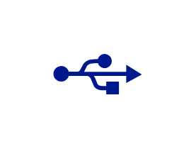

# USB

## Definition

```js
{
  _style: {
    entity: 'sketch=0;aspect=fixed;pointerEvents=1;shadow=0;dashed=0;html=1;strokeColor=none;labelPosition=center;verticalLabelPosition=bottom;verticalAlign=top;align=center;fillColor=#00188D;shape=mxgraph.mscae.enterprise.usb',
  },
  _width: 50,
  _height: 23,
}
```

## Usage

```js
import { Usb } from '@dinghy/standard-components-diagrams/caeEnterpriseFlat'

<Usb/>
```

## Preview


