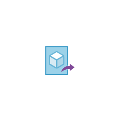

# Image Definitions

## Definition

```js
{
  _style: {
    entity: 'image;sketch=0;aspect=fixed;html=1;points=[];align=center;fontSize=12;image=img/lib/mscae/Image_Definitions.svg;strokeColor=none;',
  },
  _width: 50,
  _height: 39,
}
```

## Usage

```js
import { ImageDefinitions } from '@dinghy/standard-components-diagrams/caeOtherCategoryService'

<ImageDefinitions/>
```

## Preview


