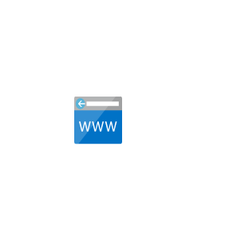
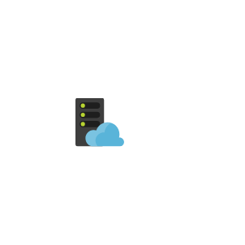

# Cae Web Service Entities

- [AppServiceCertificates](./app-service-certificates.md)  

- [AppServiceDomains](./app-service-domains.md)  

- [AppServiceEnvironments](./app-service-environments.md)  

- [AppServicePlans](./app-service-plans.md)  

- [AppServices](./app-services.md)  

- [AzureMediaServices](./azure-media-services.md)  

- [AzureSearch](./azure-search.md)  

- [Connection](./connection.md)  

- [NotificationHubNamespaces](./notification-hub-namespaces.md)  

- [Signalr](./signalr.md)  

