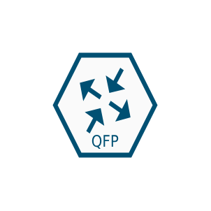
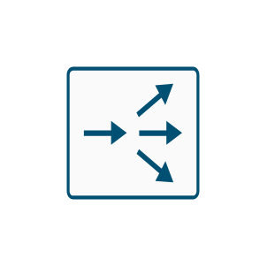
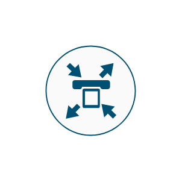
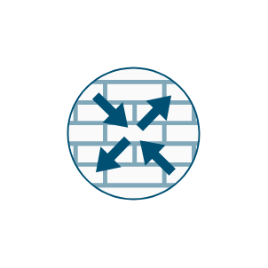
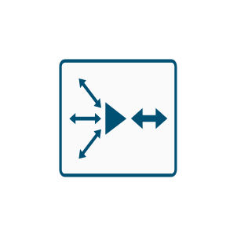

# Cisco Routing WAN Entities

- [Appnav](./appnav.md)  

- [Asr1000](./asr-1000.md)  

- [Asr9000](./asr-9000.md)  

- [Cisco15800](./cisco-15800.md)  

- [CiscoServiceReadyEngine](./cisco-service-ready-engine.md)  

- [ContentRouter](./content-router.md)  

- [Csr1000v](./csr1000v.md)  

- [IpTelephoneRouter](./ip-telephone-router.md)  

- [L3Modular](./l3-modular.md)  

- [NetflowRouter](./netflow-router.md)  

- [NetflowRouter2](./netflow-router-2.md)  

- [Router](./router.md)  

- [RouterWithFirewall](./router-with-firewall.md)  

- [RouterWithFirewall2](./router-with-firewall-2.md)  

- [RouterWithVoice](./router-with-voice.md)  

- [SecureRouterColor](./secure-router-color.md)  

- [SecureRouterSubdued](./secure-router-subdued.md)  

- [UcsExpress](./ucs-express.md)  

- [WirelessRouter](./wireless-router.md)  

