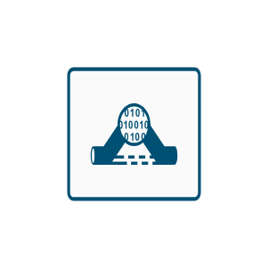
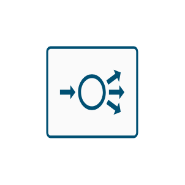
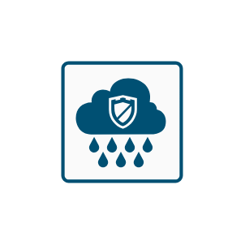
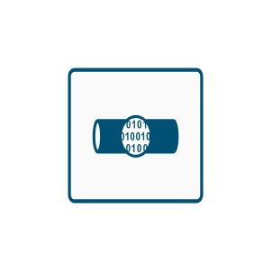
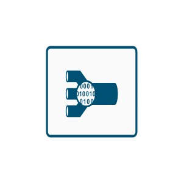
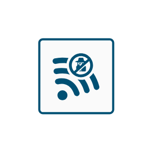

# Cisco SAFE Entities

- [AccessControlAndTrustsec](./access-control-and-trustsec.md)  

- [AnalysisCorrelation](./analysis-correlation.md)  

- [AnomalyDetection](./anomaly-detection.md)  

- [AntiMalware](./anti-malware.md)  

- [AntiMalware2](./anti-malware-2.md)  

- [AvcApplicationVisibilityControl](./avc-application-visibility-control.md)  

- [AvcApplicationVisibilityControl2](./avc-application-visibility-control-2.md)  

- [FlowAnalytics](./flow-analytics.md)  

- [FlowAnalytics2](./flow-analytics-2.md)  

- [HostBasedSecurity](./host-based-security.md)  

- [LoadBalancer](./load-balancer.md)  

- [Monitoring](./monitoring.md)  

- [Monitoring2](./monitoring-2.md)  

- [NextGenerationIntrusionPreventionSystem](./next-generation-intrusion-prevention-system.md)  

- [PolicyConfiguration](./policy-configuration.md)  

- [PostureAssessment](./posture-assessment.md)  

- [VirtualPrivateNetwork](./virtual-private-network.md)  

- [VirtualPrivateNetwork2](./virtual-private-network-2.md)  

- [VirtualPrivateNetworkConnector](./virtual-private-network-connector.md)  

- [WebApplicationFirewall](./web-application-firewall.md)  

- [WebReputationFiltering](./web-reputation-filtering.md)  

- [WebReputationFiltering2](./web-reputation-filtering-2.md)  

- [WebSecurityServices](./web-security-services.md)  

- [WebSecurityServices2](./web-security-services-2.md)  

- [WirelessIntrusionPrevention](./wireless-intrusion-prevention.md)  

