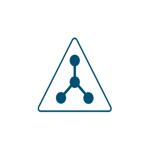

# LDAP

## Definition

```js
{
  _style: {
    entity: 'points=[[0.5,0,0],[0.765,0.48,0],[0.99,0.98,0],[0.5,1,0],[0.01,0.98,0],[0.235,0.48,0]];verticalLabelPosition=bottom;sketch=0;html=1;verticalAlign=top;aspect=fixed;align=center;pointerEvents=1;shape=mxgraph.cisco19.ldap;fillColor=#005073;strokeColor=none;',
  },
  _original_width: 50,
  _original_height: 42.5,

}
```

## Usage

```js
import { Ldap } from '@dinghy/standard-components-diagrams/cisco19SecurityCloudsAndConnectors'

<Ldap/>
```

## Preview


