# Cisco Architecture Entities

- [AccessSwitch](./access-switch.md)  
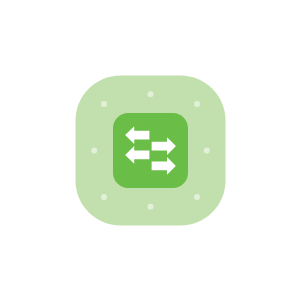

- [AciController](./aci-controller.md)  
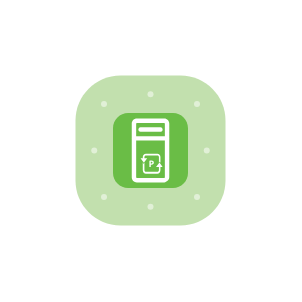

- [AciLeafSwitch](./aci-leaf-switch.md)  
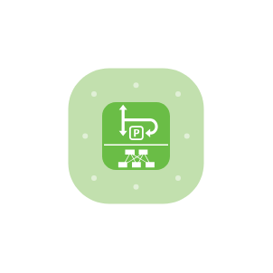

- [AciSpineSwitch](./aci-spine-switch.md)  

- [Actuator](./actuator.md)  

- [AdaptiveSecurityAppliance](./adaptive-security-appliance.md)  
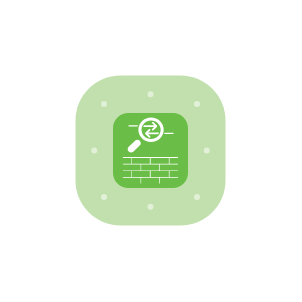

- [AutomatedSystem](./automated-system.md)  

- [BladeServer](./blade-server.md)  
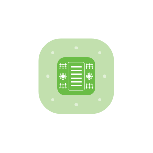

- [CatalystSwitch](./catalyst-switch.md)  
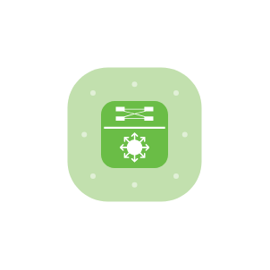

- [CiscoAppliance](./cisco-appliance.md)  

- [CoreSwitch](./core-switch.md)  
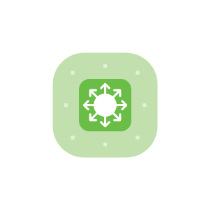

- [CorporateDevice](./corporate-device.md)  

- [CorporateWirelessDevice](./corporate-wireless-device.md)  

- [DdosProtectionAppliance](./ddos-protection-appliance.md)  

- [DistributionSwitch](./distribution-switch.md)  
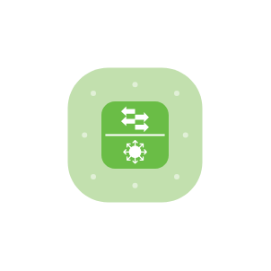

- [EmailSecurity](./email-security.md)  

- [EndpointConcentrator](./endpoint-concentrator.md)  

- [FabricSwitch](./fabric-switch.md)  

- [FirepowerAppliance](./firepower-appliance.md)  
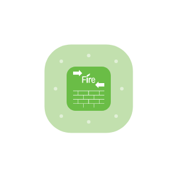

- [FirepowerManagementCenter](./firepower-management-center.md)  
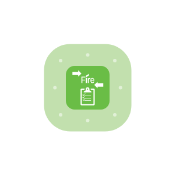

- [Firewall](./firewall.md)  
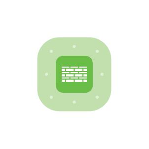

- [FlowCollector](./flow-collector.md)  
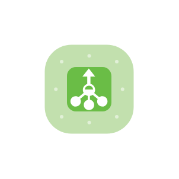

- [FlowSensor](./flow-sensor.md)  

- [GenericAppliance](./generic-appliance.md)  

- [IdentityDirectory](./identity-directory.md)  

- [IntrusionDetection](./intrusion-detection.md)  
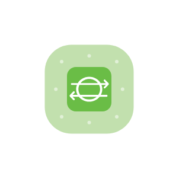

- [LoadBalancer](./load-balancer.md)  
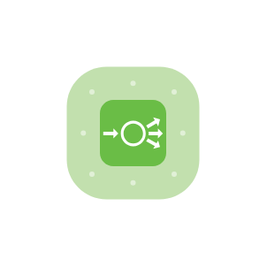

- [LogCollector](./log-collector.md)  
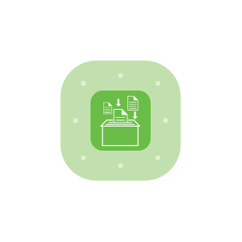

- [ManagementConsole](./management-console.md)  
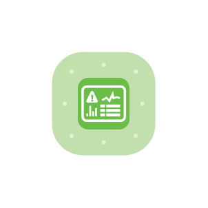

- [Mdm](./mdm.md)  
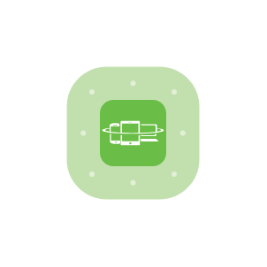

- [Mobile](./mobile.md)  

- [Monitoring](./monitoring.md)  

- [Nexus1kv](./nexus-1kv.md)  
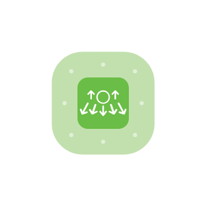

- [NexusDataCenterSwitch](./nexus-data-center-switch.md)  
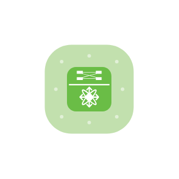

- [NexusFabricSwitch](./nexus-fabric-switch.md)  
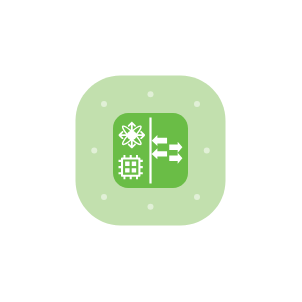

- [NexusSwitch](./nexus-switch.md)  
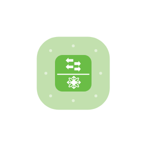

- [Ntp](./ntp.md)  

- [Phone](./phone.md)  

- [Policy](./policy.md)  

- [RadwareAppliance](./radware-appliance.md)  

- [Router](./router.md)  
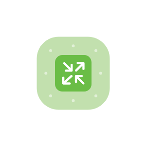

- [SandboxAppliance](./sandbox-appliance.md)  

- [SdWan](./sd-wan.md)  
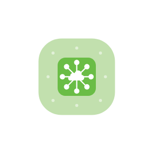

- [SdWan2](./sd-wan-2.md)  

- [SecureDns](./secure-dns.md)  

- [SecureServer](./secure-server.md)  
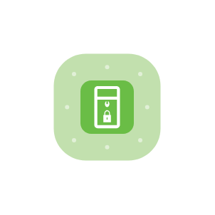

- [Sensor](./sensor.md)  
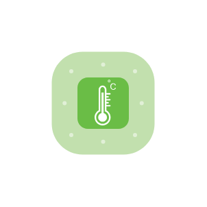

- [Server](./server.md)  

- [Siem](./siem.md)  

- [Storage](./storage.md)  

- [TetrationAnalytics](./tetration-analytics.md)  

- [TlsAppliance](./tls-appliance.md)  
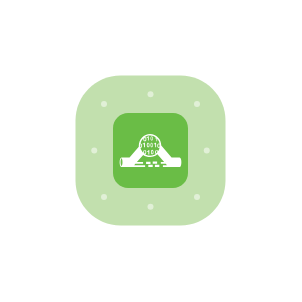

- [UdpDirector](./udp-director.md)  
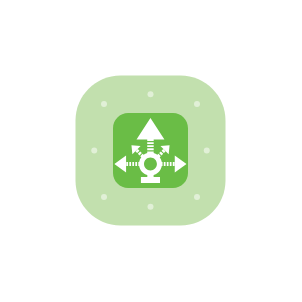

- [UnifiedAccessSwitch](./unified-access-switch.md)  
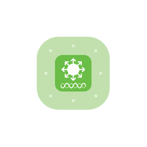

- [VideoEndpoint](./video-endpoint.md)  

- [VpnConcentrator](./vpn-concentrator.md)  
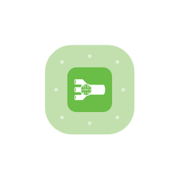

- [VulnerabilityManagement](./vulnerability-management.md)  
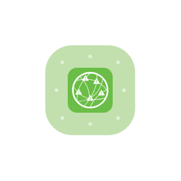

- [WebApplicationFirewall](./web-application-firewall.md)  
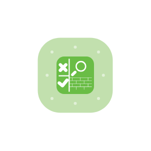

- [WebApplicationFirewall2](./web-application-firewall-2.md)  

- [WebFiltering](./web-filtering.md)  

- [WebSecurity](./web-security.md)  

- [WideAreaApplicationEngine](./wide-area-application-engine.md)  
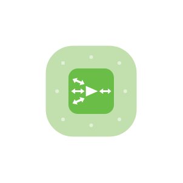

- [WirelessAccessPoint](./wireless-access-point.md)  
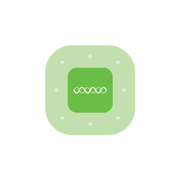

- [WirelessLanController](./wireless-lan-controller.md)  
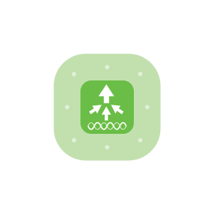
