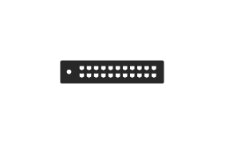

# UTM

## Definition

```js
{
  _style: {
    entity: 'verticalLabelPosition=bottom;sketch=0;html=1;fillColor=#282828;strokeColor=none;verticalAlign=top;pointerEvents=1;align=center;shape=mxgraph.cisco_safe.security_icons.utm;',
  },
  _width: 52,
  _height: 11.5,
}
```

## Usage

```js
import { Utm } from '@dinghy/standard-components-diagrams/ciscoSafeSecurityIcons'

<Utm/>
```

## Preview


