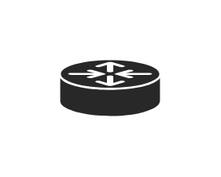
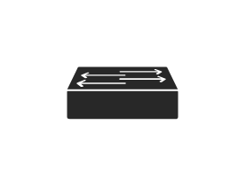
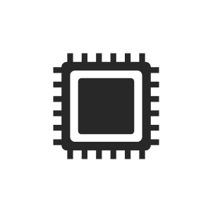
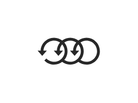

# Cisco Technology Icons Entities

- [Icon1](./icon1.md)  

- [Icon10](./icon10.md)  

- [Icon11](./icon11.md)  

- [Icon12](./icon12.md)  

- [Icon13](./icon13.md)  

- [Icon14](./icon14.md)  

- [Icon15](./icon15.md)  

- [Icon16](./icon16.md)  

- [Icon17](./icon17.md)  

- [Icon18](./icon18.md)  

- [Icon19](./icon19.md)  

- [Icon2](./icon2.md)  

- [Icon20](./icon20.md)  

- [Icon21](./icon21.md)  

- [Icon22](./icon22.md)  

- [Icon23](./icon23.md)  

- [Icon24](./icon24.md)  

- [Icon25](./icon25.md)  

- [Icon26](./icon26.md)  

- [Icon27](./icon27.md)  

- [Icon28](./icon28.md)  

- [Icon29](./icon29.md)  

- [Icon3](./icon3.md)  

- [Icon4](./icon4.md)  

- [Icon5](./icon5.md)  

- [Icon6](./icon6.md)  

- [Icon7](./icon7.md)  

- [Icon8](./icon8.md)  

- [Icon9](./icon9.md)  

