# Citrix Resources Entities

- [CitrixEnterpriseBrowser](./citrix-enterprise-browser.md)  

- [CitrixProvisioningTargetDevice](./citrix-provisioning-target-device.md)  

- [CitrixRemotePc](./citrix-remote-pc.md)  

- [CitrixVdaForMacos](./citrix-vda-for-macos.md)  
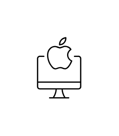

- [Hdx](./hdx.md)  
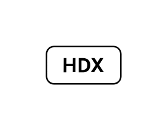

- [LinuxApp](./linux-app.md)  
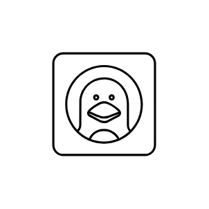

- [LinuxApps](./linux-apps.md)  

- [LinuxImage](./linux-image.md)  
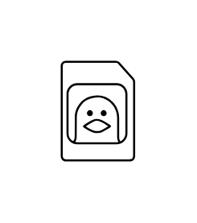

- [ProfessionalGraphicsDesktop](./professional-graphics-desktop.md)  

- [SingleAndMultiSessionWindowsAndLinuxDesktops](./single-and-multi-session-windows-and-linux-desktops.md)  
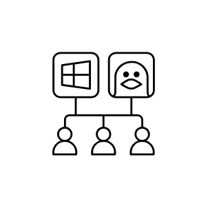

- [VirtualDesktop](./virtual-desktop.md)  

- [WebSaasApps](./web-saas-apps.md)  
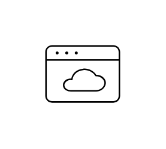

- [WindowsAndLinuxVirtualizedApps](./windows-and-linux-virtualized-apps.md)  
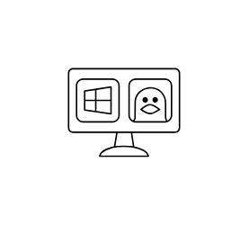

- [WindowsApp](./windows-app.md)  
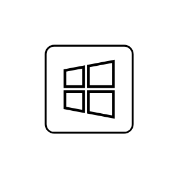

- [WindowsApps](./windows-apps.md)  
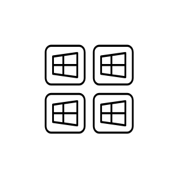

- [WindowsImage](./windows-image.md)  
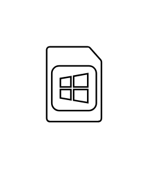

- [WindowsServerAppsAndDesktops](./windows-server-apps-and-desktops.md)  
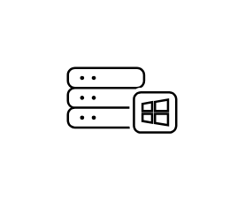
