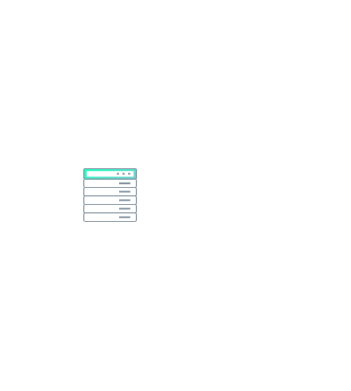

# Rack Out of Band

## Definition

```js
{
  _style: {
    entity: 'image;aspect=fixed;perimeter=ellipsePerimeter;html=1;align=center;fontSize=12;verticalAlign=top;fontColor=#364149;shadow=0;dashed=0;image=img/lib/cumulus/rack_out_of_band.svg;strokeColor=none;',
  },
  _width: 96,
  _height: 114,
}
```

## Usage

```js
import { RackOutOfBand } from '@dinghy/standard-components-diagrams/cumulus'

<RackOutOfBand/>
```

## Preview


