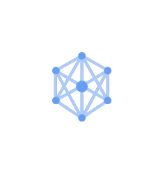
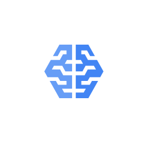

# Gcp Icons AI and Machine Learning Entities

- [AdvancedSolutionsLab](./advanced-solutions-lab.md)  

- [AiHub](./ai-hub.md)  

- [AiPlatform](./ai-platform.md)  

- [Automl](./automl.md)  

- [AutomlNaturalLanguage](./automl-natural-language.md)  

- [AutomlTables](./automl-tables.md)  

- [AutomlTranslation](./automl-translation.md)  

- [AutomlVideoIntelligence](./automl-video-intelligence.md)  

- [AutomlVision](./automl-vision.md)  

- [CloudInferenceApi](./cloud-inference-api.md)  

- [CloudJobsApi](./cloud-jobs-api.md)  

- [CloudNaturalLanguageApi](./cloud-natural-language-api.md)  

- [CloudTpu](./cloud-tpu.md)  

- [CloudTranslationApi](./cloud-translation-api.md)  

- [CloudVisionApi](./cloud-vision-api.md)  

- [DataLabeling](./data-labeling.md)  

- [Dialogflow](./dialogflow.md)  

- [RecommendationsAi](./recommendations-ai.md)  

- [SpeechToText](./speech-to-text.md)  

- [TextToSpeech](./text-to-speech.md)  

- [VideoIntelligenceApi](./video-intelligence-api.md)  

