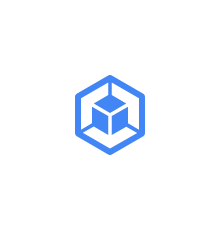

# Gcp Icons Expanded Product Card Icons Entities

- [AppEngine](./app-engine.md)  

- [CloudDataflow](./cloud-dataflow.md)  

- [CloudDataproc](./cloud-dataproc.md)  

- [ComputeEngine](./compute-engine.md)  

- [ContainerEngine](./container-engine.md)  

- [ModifiersAutoscaling](./modifiers-autoscaling.md)  

- [ModifiersCustomVirtualMachine](./modifiers-custom-virtual-machine.md)  

- [ModifiersHighCpuMachine](./modifiers-high-cpu-machine.md)  

- [ModifiersHighMemoryMachine](./modifiers-high-memory-machine.md)  

- [ModifiersPreemptableVm](./modifiers-preemptable-vm.md)  

- [ModifiersSharedCoreMachineF1](./modifiers-shared-core-machine-f1.md)  

- [ModifiersSharedCoreMachineG1](./modifiers-shared-core-machine-g1.md)  

- [ModifiersStandardMachine](./modifiers-standard-machine.md)  

- [ModifiersStorage](./modifiers-storage.md)  

