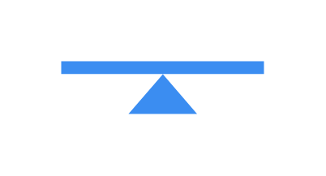

# Load Balancing

## Definition

```js
{
  _style: {
    entity: 'sketch=0;html=1;aspect=fixed;strokeColor=none;shadow=0;fillColor=#3B8DF1;verticalAlign=top;labelPosition=center;verticalLabelPosition=bottom;shape=mxgraph.gcp2.load_balancing',
  },
  _width: 100,
  _height: 26,
}
```

## Usage

```js
import { LoadBalancing } from '@dinghy/standard-components-diagrams/gcp2GeneralIcons'

<LoadBalancing/>
```

## Preview


