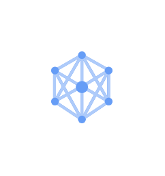
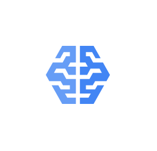
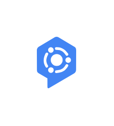
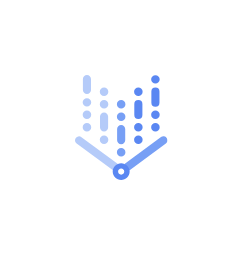

# Gcp2 AI and Machine Learning Entities

- [AdvancedSolutionsLab](./advanced-solutions-lab.md)  

- [AgentAssist](./agent-assist.md)  

- [AiHub](./ai-hub.md)  

- [Automl](./automl.md)  

- [AutomlTables](./automl-tables.md)  

- [AutomlTranslation](./automl-translation.md)  

- [AutomlVision](./automl-vision.md)  

- [AutomlNaturalLanguage](./automl-natural-language.md)  

- [AutomlVideoIntelligence](./automl-video-intelligence.md)  

- [CloudInferenceApi](./cloud-inference-api.md)  

- [CloudTalentSolutions](./cloud-talent-solutions.md)  

- [CloudTpu](./cloud-tpu.md)  

- [CloudTranslationApi](./cloud-translation-api.md)  

- [CloudVisionApi](./cloud-vision-api.md)  

- [CloudAi](./cloud-ai.md)  

- [CloudNaturalLanguageApi](./cloud-natural-language-api.md)  

- [ContactCenterAi](./contact-center-ai.md)  

- [ContactCenterAiPlatform](./contact-center-ai-platform.md)  

- [DataLabeling](./data-labeling.md)  

- [DialogflowEnterpriseEdition](./dialogflow-enterprise-edition.md)  

- [DocumentAi](./document-ai.md)  

- [DocumentAiWarehouse](./document-ai-warehouse.md)  

- [RecommendationsAi](./recommendations-ai.md)  

- [RetailApi](./retail-api.md)  

- [SpeechToText](./speech-to-text.md)  

- [TextToSpeech](./text-to-speech.md)  

- [VertexAi](./vertex-ai.md)  

- [VideoIntelligenceApi](./video-intelligence-api.md)  

- [VisualInspectionAi](./visual-inspection-ai.md)  

