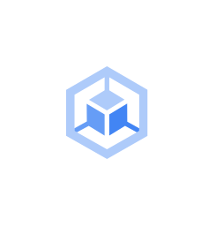

# Google Kubernetes
Engine

## Definition

```js
{
  _style: {
    entity: 'sketch=0;html=1;verticalAlign=top;labelPosition=center;verticalLabelPosition=bottom;align=center;spacingTop=-6;fontSize=11;fontStyle=1;fontColor=#999999;shape=image;aspect=fixed;imageAspect=0;image=data:image/svg+xml,PHN2ZyB4bWxucz0iaHR0cDovL3d3dy53My5vcmcvMjAwMC9zdmciIHhtbG5zOnY9Imh0dHBzOi8vdmVjdGEuaW8vbmFubyIgd2lkdGg9IjMyOS45MjU5OTcyMzE3OTM4IiBoZWlnaHQ9IjM3OC4yODQ5OTAzMTEyNzg4IiB2aWV3Qm94PSIwIDAgODcuMjkyOTk5MjY3NTc4MTIgMTAwLjA4Nzk5NzQzNjUyMzQ0Ij4mI3hhOzxzdHlsZSB0eXBlPSJ0ZXh0L2NzcyI+JiN4YTsJLnN0MHtmaWxsOiNhZWNiZmE7fSYjeGE7CS5zdDF7ZmlsbDojNjY5ZGY2O30mI3hhOwkuc3Qye2ZpbGw6IzQyODVmNDt9JiN4YTs8L3N0eWxlPiYjeGE7CTxwYXRoIGNsYXNzPSJzdDAiIGQ9Ik00My43NTEgMEwwIDI1LjQ2NXYyLjU4OCA0Ni45Mmw0My43NTIgMjUuMTE1IDQzLjU0MS0yNS4xMjFWMjUuNDczem0yLjQzOCAxMS44NTNsMzIuMTAzIDE4Ljc4MlY2OS43N0w0My43MzkgODkuNzA1IDkgNjkuNzYyVjMwLjY0MWwzMi4xOS0xOC43MzZ2MTQuMTU0TDI0LjUwMyAzNi4xNTNsMTkuMTcyIDExLjUwMiAxOC44ODYtMTEuNTU0LTE2LjM3Mi0xMC4wMjR6Ii8+JiN4YTsJPHBhdGggY2xhc3M9InN0MSIgZD0iTTIyLjAyNSA0MC40OTZsLjE2NiAxOS4xNDMtMTMuMjQ3IDcuMzN2Mi43NDJsMi42MzcgMS41MTQgMTIuNjQ4LTYuOTk5IDE2Ljk2MSAxMC42MDJWNTEuOTkzeiIvPiYjeGE7CTxwYXRoIGNsYXNzPSJzdDIiIGQ9Ik02NS4zNDQgNDAuMjZMNDYuMTg5IDUxLjk3OXYyMi44NDdsMTYuODk5LTEwLjU3NiAxMi41MzkgNi45NzQgMi42MDktMS41MDV2LTIuNzY1bC0xMi43ODQtNy4xMTJ6Ii8+JiN4YTs8L3N2Zz4=;strokeColor=none;',
  },
  _width: 37,
  _height: 42,
}
```

## Usage

```js
import { GoogleKubernetesEngine } from '@dinghy/standard-components-diagrams/gcp2IconsCompute'

<GoogleKubernetesEngine/>
```

## Preview


