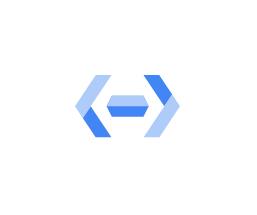
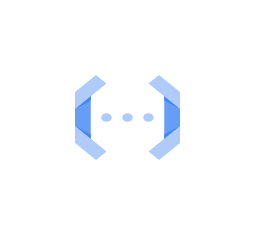

# Gcp2 Serverless Entities

- [ApiGateway](./api-gateway.md)  

- [AppEngine](./app-engine.md)  

- [CloudEndpoints](./cloud-endpoints.md)  

- [CloudFunctions](./cloud-functions.md)  

- [CloudRun](./cloud-run.md)  

