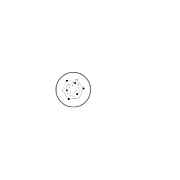

# Ibm Blockchain Entities

- [Blockchain](./blockchain.md)  

- [BlockchainDeveloper](./blockchain-developer.md)  

- [CertificateAuthority](./certificate-authority.md)  

- [ClientApplication](./client-application.md)  

- [Communication](./communication.md)  

- [Consensus](./consensus.md)  

- [ECert](./e-cert.md)  

- [Event](./event.md)  

- [EventListener](./event-listener.md)  

- [ExistingEnterpriseSystems](./existing-enterprise-systems.md)  

- [HyperledgerFabric](./hyperledger-fabric.md)  

- [IdentityAccessManager](./identity-access-manager.md)  

- [KeyManagement](./key-management.md)  

- [Ledger](./ledger.md)  

- [Membership](./membership.md)  

- [MembershipServicesProviderApi](./membership-services-provider-api.md)  

- [MessageBus](./message-bus.md)  

- [Node](./node.md)  

- [Services](./services.md)  

- [SmartContract](./smart-contract.md)  

- [TransactionManager](./transaction-manager.md)  

- [Wallet](./wallet.md)  

