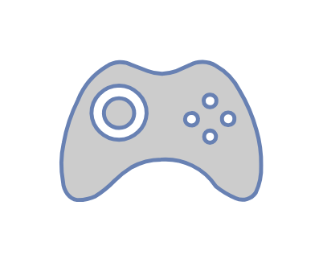

# Gamepad

## Definition

```js
{
  _style: {
    entity: 'fontColor=#0066CC;verticalAlign=top;verticalLabelPosition=bottom;labelPosition=center;align=center;html=1;outlineConnect=0;fillColor=#CCCCCC;strokeColor=#6881B3;gradientColor=none;gradientDirection=north;strokeWidth=2;shape=mxgraph.networks.gamepad;',
  },
  _width: 100,
  _height: 70,
}
```

## Usage

```js
import { Gamepad } from '@dinghy/standard-components-diagrams/network'

<Gamepad/>
```

## Preview


