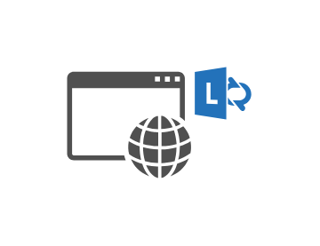

# Lync Web App Client

## Definition

```js
{
  _style: {
    entity: 'sketch=0;pointerEvents=1;shadow=0;dashed=0;html=1;strokeColor=none;fillColor=#505050;labelPosition=center;verticalLabelPosition=bottom;verticalAlign=top;outlineConnect=0;align=center;shape=mxgraph.office.communications.lync_web_app_client;',
  },
  _width: 83,
  _height: 50,
}
```

## Usage

```js
import { LyncWebAppClient } from '@dinghy/standard-components-diagrams/officeCommunications'

<LyncWebAppClient/>
```

## Preview


