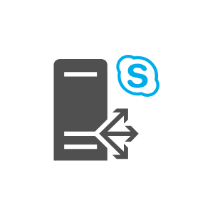
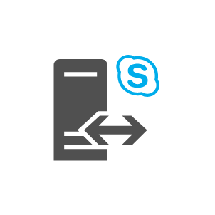
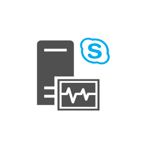

# Office Servers Entities

- [Component3rdPartyMailServer](./component-3rd-party-mail-server.md)  

- [ActiveDirectoryFederationServicesProxy](./active-directory-federation-services-proxy.md)  

- [ActiveDirectoryFederationServicesServer](./active-directory-federation-services-server.md)  

- [ActiveDirectoryFederationServicesServerBlue](./active-directory-federation-services-server-blue.md)  

- [ActiveDirectoryFederationServicesServerGhosted](./active-directory-federation-services-server-ghosted.md)  

- [ActiveDirectoryFederationServicesServerGreen](./active-directory-federation-services-server-green.md)  

- [ActiveDirectoryFederationServicesServerOrange](./active-directory-federation-services-server-orange.md)  

- [ApplicationServer](./application-server.md)  

- [ApplicationServerBlue](./application-server-blue.md)  

- [ApplicationServerGhosted](./application-server-ghosted.md)  

- [ApplicationServerGreen](./application-server-green.md)  

- [ApplicationServerOrange](./application-server-orange.md)  

- [CallAdmissionControlService](./call-admission-control-service.md)  

- [CertificateAuthority](./certificate-authority.md)  

- [ClusterServer](./cluster-server.md)  

- [DatabaseServer](./database-server.md)  

- [DatabaseServerBlue](./database-server-blue.md)  

- [DatabaseServerGhosted](./database-server-ghosted.md)  

- [DatabaseServerGreen](./database-server-green.md)  

- [DatabaseServerOrange](./database-server-orange.md)  

- [Datacenter](./datacenter.md)  

- [DirsyncServer](./dirsync-server.md)  

- [DomainController](./domain-controller.md)  

- [ExchangeClientAccessServer](./exchange-client-access-server.md)  

- [ExchangeClientAccessServerRole](./exchange-client-access-server-role.md)  

- [ExchangeEdgeTransportServer](./exchange-edge-transport-server.md)  

- [ExchangeEdgeTransportServerRole](./exchange-edge-transport-server-role.md)  

- [ExchangeHubTransportServerRole](./exchange-hub-transport-server-role.md)  

- [ExchangeMailboxServer](./exchange-mailbox-server.md)  

- [ExchangeMailboxServerRole](./exchange-mailbox-server-role.md)  

- [ExchangeServer](./exchange-server.md)  

- [ExchangeUmServerRole](./exchange-um-server-role.md)  

- [FileServer](./file-server.md)  

- [HybridServer](./hybrid-server.md)  

- [Mainframe](./mainframe.md)  

- [MainframeHost](./mainframe-host.md)  

- [MonitoringSqlReportingServices](./monitoring-sql-reporting-services.md)  

- [Network](./network.md)  

- [OfficeWebAppsServer](./office-web-apps-server.md)  

- [OnPremisesServer](./on-premises-server.md)  

- [PhysicalHost](./physical-host.md)  

- [PhysicalHostFarm](./physical-host-farm.md)  

- [ReverseProxy](./reverse-proxy.md)  

- [Scom](./scom.md)  

- [ServerDisaster](./server-disaster.md)  

- [ServerFarm](./server-farm.md)  

- [ServerFarmBlue](./server-farm-blue.md)  

- [ServerFarmGhosted](./server-farm-ghosted.md)  

- [ServerFarmGreen](./server-farm-green.md)  

- [ServerFarmOrange](./server-farm-orange.md)  

- [ServerSideCode](./server-side-code.md)  

- [ServerGeneric](./server-generic.md)  

- [ServerGenericBlue](./server-generic-blue.md)  

- [ServerGenericGhosted](./server-generic-ghosted.md)  

- [ServerGenericGreen](./server-generic-green.md)  

- [ServerGenericOrange](./server-generic-orange.md)  

- [SharepointServer](./sharepoint-server.md)  

- [SkypeForBusinessBackEndServer](./skype-for-business-back-end-server.md)  

- [SkypeForBusinessBackEndServerMirror](./skype-for-business-back-end-server-mirror.md)  

- [SkypeForBusinessDirector](./skype-for-business-director.md)  

- [SkypeForBusinessDirectorArray](./skype-for-business-director-array.md)  

- [SkypeForBusinessEdgeServer](./skype-for-business-edge-server.md)  

- [SkypeForBusinessEdgeServerPool](./skype-for-business-edge-server-pool.md)  

- [SkypeForBusinessFrontEndPool](./skype-for-business-front-end-pool.md)  

- [SkypeForBusinessFrontEndServer](./skype-for-business-front-end-server.md)  

- [SkypeForBusinessMediationServer](./skype-for-business-mediation-server.md)  

- [SkypeForBusinessMonitoringServer](./skype-for-business-monitoring-server.md)  

- [SkypeForBusinessPersistentChatServer](./skype-for-business-persistent-chat-server.md)  

- [SkypeForBusinessServer](./skype-for-business-server.md)  

- [SqlServer](./sql-server.md)  

- [SurvivableBranchAppliance](./survivable-branch-appliance.md)  

- [SurvivableBranchServer](./survivable-branch-server.md)  

- [TopologyBuilder](./topology-builder.md)  

- [TrustedApplicationPool](./trusted-application-pool.md)  

- [TrustedApplicationServer](./trusted-application-server.md)  

- [TunnelAngled](./tunnel-angled.md)  

- [TunnelStraight](./tunnel-straight.md)  

- [UniversalSecurityGroup](./universal-security-group.md)  

- [VideoInteropServer](./video-interop-server.md)  

- [VirtualApplicationServer](./virtual-application-server.md)  

- [VirtualApplicationServerBlue](./virtual-application-server-blue.md)  

- [VirtualDatabaseServer](./virtual-database-server.md)  

- [VirtualDatabaseServerBlue](./virtual-database-server-blue.md)  

- [VirtualServer](./virtual-server.md)  

- [VirtualServerBlue](./virtual-server-blue.md)  

- [VirtualWebServer](./virtual-web-server.md)  

- [VirtualWebServerBlue](./virtual-web-server-blue.md)  

- [VociemailPreviewPartner](./vociemail-preview-partner.md)  

- [WebServer](./web-server.md)  

- [WebServerBlue](./web-server-blue.md)  

- [WebServerGhosted](./web-server-ghosted.md)  

- [WebServerGreen](./web-server-green.md)  

- [WebServerOrange](./web-server-orange.md)  

- [WindowsRouter](./windows-router.md)  

- [WindowsServer](./windows-server.md)  

