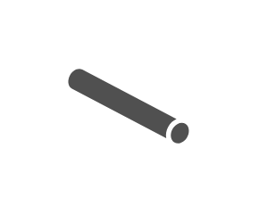

# Tunnel Angled

## Definition

```js
{
  _style: {
    entity: 'sketch=0;pointerEvents=1;shadow=0;dashed=0;html=1;strokeColor=none;fillColor=#505050;labelPosition=center;verticalLabelPosition=bottom;verticalAlign=top;outlineConnect=0;align=center;shape=mxgraph.office.servers.tunnel_angled;',
  },
  _width: 55,
  _height: 35,
}
```

## Usage

```js
import { TunnelAngled } from '@dinghy/standard-components-diagrams/officeServers'

<TunnelAngled/>
```

## Preview


