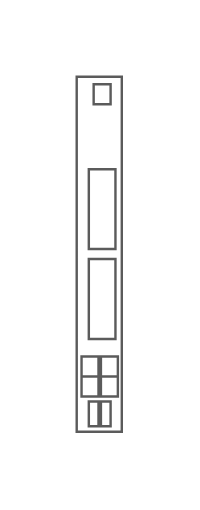

# Cisco Catalyst Blade Switch 3032 for Dell

## Definition

```js
{
  _style: {
    entity: 'shape=mxgraph.rack.cisco.cisco_catalyst_blade_switch_3032_for_dell;html=1;labelPosition=right;align=left;spacingLeft=15;dashed=0;shadow=0;fillColor=#ffffff;',
  },
  _width: 19,
  _height: 143,
}
```

## Usage

```js
import { CiscoCatalystBladeSwitch3032ForDell } from '@dinghy/standard-components-diagrams/rackCisco'

<CiscoCatalystBladeSwitch3032ForDell/>
```

## Preview


