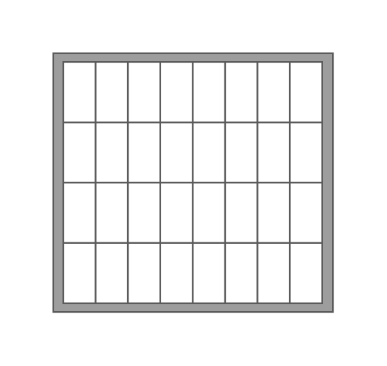

# PowerEdge M1000e Enclosure

## Definition

```js
{
  _style: {
    entity: 'strokeColor=#666666;html=1;labelPosition=right;align=left;spacingLeft=15;shadow=0;dashed=0;outlineConnect=0;shape=mxgraph.rack.dell.poweredge_m1000e_enclosure;',
  },
  _width: 162,
  _height: 150,
}
```

## Usage

```js
import { PoweredgeM1000eEnclosure } from '@dinghy/standard-components-diagrams/rackDell'

<PoweredgeM1000eEnclosure/>
```

## Preview


