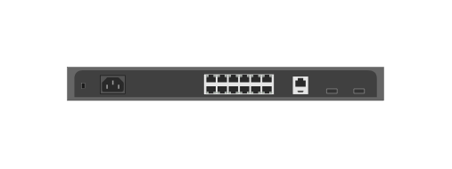

# Aruba 9012 10-Port GbE Gateway (back)

## Definition

```js
{
  _style: {
    entity: 'html=1;verticalLabelPosition=bottom;verticalAlign=top;outlineConnect=0;shadow=0;dashed=0;shape=mxgraph.rack.hpe_aruba.gateways_controllers.aruba_9012_10_port_gbe_gateway_back;',
  },
  _width: 142,
  _height: 15,
}
```

## Usage

```js
import { Aruba901210PortGbeGatewayBack } from '@dinghy/standard-components-diagrams/rackHpeArubaSwitches'

<Aruba901210PortGbeGatewayBack/>
```

## Preview


