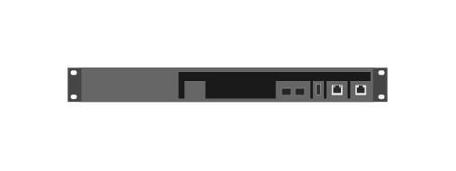

# Aruba Mobility Master 10k (front)

## Definition

```js
{
  _style: {
    entity: 'html=1;verticalLabelPosition=bottom;verticalAlign=top;outlineConnect=0;shadow=0;dashed=0;shape=mxgraph.rack.hpe_aruba.gateways_controllers.aruba_mobility_master_10k_front;',
  },
  _width: 142,
  _height: 15,
}
```

## Usage

```js
import { ArubaMobilityMaster10kFront } from '@dinghy/standard-components-diagrams/rackHpeArubaSwitches'

<ArubaMobilityMaster10kFront/>
```

## Preview


