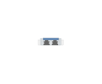

# Fibre QSFP

## Definition

```js
{
  _style: {
    entity: 'html=1;verticalLabelPosition=bottom;verticalAlign=top;outlineConnect=0;shadow=0;dashed=0;shape=mxgraph.rack.hpe_aruba.switches.fibre_qsfp;',
  },
  _width: 20,
  _height: 5.7,
}
```

## Usage

```js
import { FibreQsfp } from '@dinghy/standard-components-diagrams/rackHpeArubaSwitches'

<FibreQsfp/>
```

## Preview


