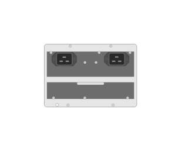

# J9830B 5400R 2750W PoE+ zl2 Power Supply

## Definition

```js
{
  _style: {
    entity: 'html=1;verticalLabelPosition=bottom;verticalAlign=top;outlineConnect=0;shadow=0;dashed=0;shape=mxgraph.rack.hpe_aruba.switches.j9830b_5400r_2750w_poeplus_zl2_power_supply;',
  },
  _width: 63,
  _height: 43,
}
```

## Usage

```js
import { J9830b5400r2750wPoeZl2PowerSupply } from '@dinghy/standard-components-diagrams/rackHpeArubaSwitches'

<J9830b5400r2750wPoeZl2PowerSupply/>
```

## Preview


