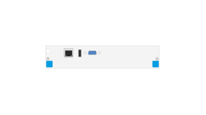

# J9858A Adv Svcs v2 zl Module

## Definition

```js
{
  _style: {
    entity: 'html=1;verticalLabelPosition=bottom;verticalAlign=top;outlineConnect=0;shadow=0;dashed=0;shape=mxgraph.rack.hpe_aruba.switches.j9858a_adv_svcs_v2_zl_module;',
  },
  _width: 75,
  _height: 15,
}
```

## Usage

```js
import { J9858aAdvSvcsV2ZlModule } from '@dinghy/standard-components-diagrams/rackHpeArubaSwitches'

<J9858aAdvSvcsV2ZlModule/>
```

## Preview


