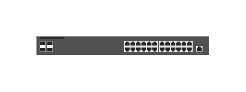

# JL253A Aruba 2930F-24G 4SFP+ switch

## Definition

```js
{
  _style: {
    entity: 'html=1;verticalLabelPosition=bottom;verticalAlign=top;outlineConnect=0;shadow=0;dashed=0;shape=mxgraph.rack.hpe_aruba.switches.jl253a_aruba_2930f_24g_4sfpplus_switch;',
  },
  _width: 142,
  _height: 15,
}
```

## Usage

```js
import { Jl253aAruba2930f24g4sfpSwitch } from '@dinghy/standard-components-diagrams/rackHpeArubaSwitches'

<Jl253aAruba2930f24g4sfpSwitch/>
```

## Preview


