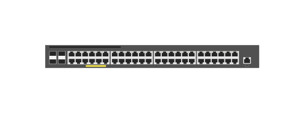

# JL262A Aruba 2930F-48G PoE+ 4SFP switch

## Definition

```js
{
  _style: {
    entity: 'html=1;verticalLabelPosition=bottom;verticalAlign=top;outlineConnect=0;shadow=0;dashed=0;shape=mxgraph.rack.hpe_aruba.switches.jl262a_aruba_2930f_48g_poeplus_4sfp_switch;',
  },
  _width: 142,
  _height: 15,
}
```

## Usage

```js
import { Jl262aAruba2930f48gPoe4sfpSwitch } from '@dinghy/standard-components-diagrams/rackHpeArubaSwitches'

<Jl262aAruba2930f48gPoe4sfpSwitch/>
```

## Preview


