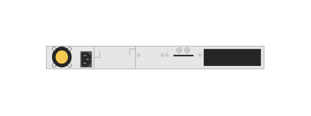

# JL322A Aruba 2930M-48G PoE+ 1-slot Switch (rear)

## Definition

```js
{
  _style: {
    entity: 'html=1;verticalLabelPosition=bottom;verticalAlign=top;outlineConnect=0;shadow=0;dashed=0;shape=mxgraph.rack.hpe_aruba.switches.jl322a_aruba_2930m_48g_poeplus_1_slot_switch_rear;',
  },
  _width: 142,
  _height: 15,
}
```

## Usage

```js
import { Jl322aAruba2930m48gPoe1SlotSwitchRear } from '@dinghy/standard-components-diagrams/rackHpeArubaSwitches'

<Jl322aAruba2930m48gPoe1SlotSwitchRear/>
```

## Preview


