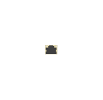

# rj45 SFP

## Definition

```js
{
  _style: {
    entity: 'html=1;verticalLabelPosition=bottom;verticalAlign=top;outlineConnect=0;shadow=0;dashed=0;shape=mxgraph.rack.hpe_aruba.switches.rj45_sfp;',
  },
  _width: 8,
  _height: 6,
}
```

## Usage

```js
import { Rj45Sfp } from '@dinghy/standard-components-diagrams/rackHpeArubaSwitches'

<Rj45Sfp/>
```

## Preview


