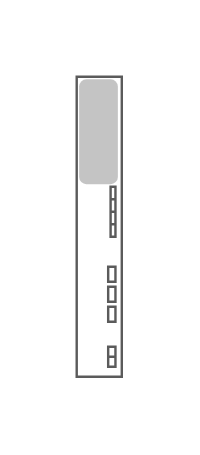

# Sun Blade 6000 Ethernet Network Express Module 24p 10 GbE

## Definition

```js
{
  _style: {
    entity: 'shape=mxgraph.rack.oracle.sun_blade_6000_ethernet_network_express_module_24p_10_gbe;html=1;labelPosition=right;align=left;spacingLeft=15;dashed=0;shadow=0;fillColor=#ffffff;',
  },
  _width: 19,
  _height: 121,
}
```

## Usage

```js
import { SunBlade6000EthernetNetworkExpressModule24p10Gbe } from '@dinghy/standard-components-diagrams/rackOracle'

<SunBlade6000EthernetNetworkExpressModule24p10Gbe/>
```

## Preview


