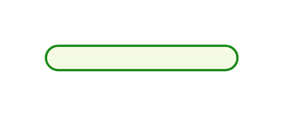
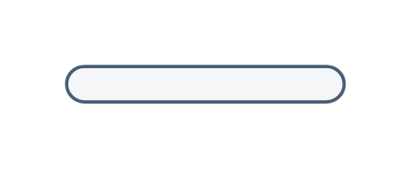
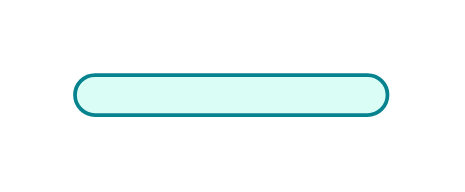
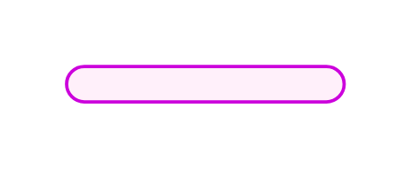

# Sap Annotations and Interfaces Entities

- [Authenticate](./authenticate.md)  

- [Authenticate2](./authenticate-2.md)  

- [Authenticate3](./authenticate-3.md)  

- [Authorize](./authorize.md)  

- [Authorize2](./authorize-2.md)  

- [Authorize3](./authorize-3.md)  

- [GenericProtocol](./generic-protocol.md)  

- [GenericProtocol2](./generic-protocol-2.md)  

- [GenericProtocol3](./generic-protocol-3.md)  

- [Interface](./interface.md)  

- [Interface2](./interface-2.md)  

- [Protocol](./protocol.md)  

- [Protocol2](./protocol-2.md)  

- [Protocol3](./protocol-3.md)  

- [Protocol4](./protocol-4.md)  

- [Protocol5](./protocol-5.md)  

- [Protocol6](./protocol-6.md)  

- [Trust](./trust.md)  

- [Trust2](./trust-2.md)  

- [Trust3](./trust-3.md)  

