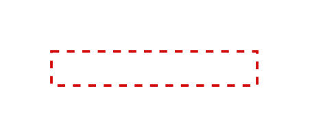

# Error, Dashed 4

## Definition

```js
{
  _style: {
    entity: 'edgeStyle=orthogonalEdgeStyle;rounded=0;orthogonalLoop=1;jettySize=auto;html=1;fontSize=18;strokeColor=#d20a0a;fontFamily=Helvetica;fontColor=default;targetPerimeterSpacing=15;endSize=4;startSize=4;dashed=1;endArrow=blockThin;endFill=1;strokeWidth=1.5;startArrow=none;startFill=0;',
  },
  _width: 120,
  _height: 20,
}
```

## Usage

```js
import { ErrorDashed4 } from '@dinghy/standard-components-diagrams/sapConnectors'

<ErrorDashed4/>
```

## Preview


