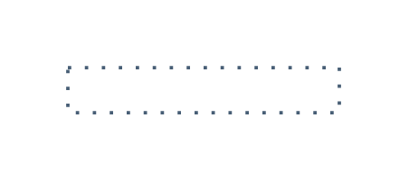

# Sap Default Connectors Entities

- [DefaultFirewall](./default-firewall.md)  

- [DirectBidirectional](./direct-bidirectional.md)  

- [DirectElbow](./direct-elbow.md)  

- [DirectOneDirectional](./direct-one-directional.md)  

- [IndirectBidirectional](./indirect-bidirectional.md)  

- [IndirectElbow](./indirect-elbow.md)  

- [IndirectOneDirectional](./indirect-one-directional.md)  

- [OptionalBidirectional](./optional-bidirectional.md)  

- [OptionalElbow](./optional-elbow.md)  

- [OptionalOneDirectional](./optional-one-directional.md)  

- [PlainDirect](./plain-direct.md)  

- [PlainIndirect](./plain-indirect.md)  

- [PlainOptional](./plain-optional.md)  

