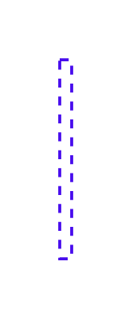
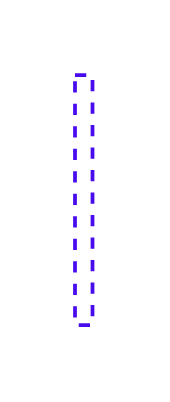
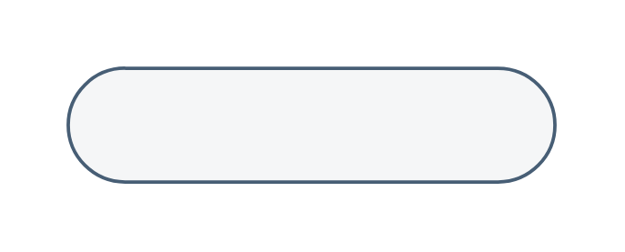
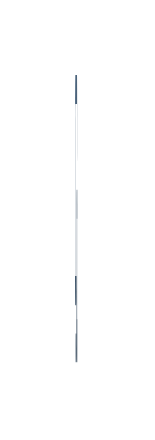

# Sap Essentials Entities

- [Component3rdPartyIdentityProviderIdentityManagement](./component-3rd-party-identity-provider-identity-management.md)  

- [Component3rdPartyIdpAndProtocols](./component-3rd-party-idp-and-protocols.md)  

- [Component3rdPartyIdpAndProtocols2](./component-3rd-party-idp-and-protocols-2.md)  

- [Component3rdPartyIdpAndProtocols3](./component-3rd-party-idp-and-protocols-3.md)  

- [Component3rdPartyIdpAndProtocols4](./component-3rd-party-idp-and-protocols-4.md)  

- [Component3rdPartyIdpAndProtocols5](./component-3rd-party-idp-and-protocols-5.md)  

- [Component3rdPartyIdpAndProtocols6](./component-3rd-party-idp-and-protocols-6.md)  

- [Component3rdPartyLayer](./component-3rd-party-layer.md)  

- [BtpBaseLayer](./btp-base-layer.md)  

- [CloudConnector](./cloud-connector.md)  

- [DiagramTitle](./diagram-title.md)  

- [DiagramTitle2](./diagram-title-2.md)  

- [HttpsProtocol](./https-protocol.md)  

- [HttpsProtocol2](./https-protocol-2.md)  

- [HttpsProtocol3](./https-protocol-3.md)  

- [Legend](./legend.md)  

- [SamlOidc](./saml-oidc.md)  

- [SamlOidc2](./saml-oidc-2.md)  

- [SamlOidc3](./saml-oidc-3.md)  

- [SapOnPremiseSolutionBox](./sap-on-premise-solution-box.md)  

- [UserAndClient](./user-and-client.md)  

- [UserAndClient2](./user-and-client-2.md)  

- [UserAndClient3](./user-and-client-3.md)  

- [UserAndClient4](./user-and-client-4.md)  

