# Veeam VMs and Tape Entities

- [Component1ClickFailoverOrchestration](./component-1-click-failover-orchestration.md)  

- [Active](./active.md)  

- [ActiveDirectory](./active-directory.md)  

- [AdvancedRefsIntegration](./advanced-refs-integration.md)  

- [Agent](./agent.md)  

- [Agents](./agents.md)  

- [Alarm](./alarm.md)  

- [Alert](./alert.md)  

- [ArchiveTier](./archive-tier.md)  

- [AssistedFailoverAndFailback](./assisted-failover-and-failback.md)  

- [AudioFile](./audio-file.md)  

- [AutomatedTesting](./automated-testing.md)  

- [AvailabilityConsole](./availability-console.md)  

- [AvailabilityOrchestrator](./availability-orchestrator.md)  

- [AvailabilitySuite](./availability-suite.md)  

- [BackupAndReplication](./backup-and-replication.md)  

- [BackupAndReplicationServer](./backup-and-replication-server.md)  
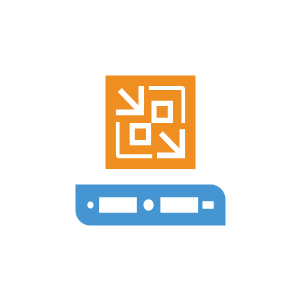

- [BackupBrowser](./backup-browser.md)  

- [BackupEnterpriseManagerServer](./backup-enterprise-manager-server.md)  

- [BackupFile](./backup-file.md)  

- [BackupForOffice365](./backup-for-office-365.md)  

- [BackupFromStorageSnapshots](./backup-from-storage-snapshots.md)  

- [BackupRepository](./backup-repository.md)  

- [Building](./building.md)  

- [BuiltInManagementForAgents](./built-in-management-for-agents.md)  

- [BuiltInWanAcceleration](./built-in-wan-acceleration.md)  

- [ChargebackAndBillingCapabilities](./chargeback-and-billing-capabilities.md)  

- [Checked](./checked.md)  

- [CheckedDoc](./checked-doc.md)  

- [Cloud](./cloud.md)  

- [CloudConnect](./cloud-connect.md)  

- [Cluster](./cluster.md)  
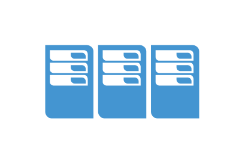

- [CompanyAdministrator](./company-administrator.md)  

- [CompanyOwner](./company-owner.md)  

- [CompanyUser](./company-user.md)  

- [ContinuousDataProtection](./continuous-data-protection.md)  

- [Controller](./controller.md)  

- [Cpu](./cpu.md)  

- [CpuSocket](./cpu-socket.md)  

- [DataCenter](./data-center.md)  

- [DataFile](./data-file.md)  

- [DataMover](./data-mover.md)  

- [DataVolume](./data-volume.md)  
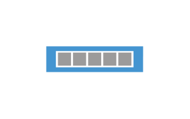

- [Database](./database.md)  

- [DatabaseServer](./database-server.md)  

- [Datastore](./datastore.md)  

- [Datastore2](./datastore-2.md)  

- [Deduplication](./deduplication.md)  

- [Delayed](./delayed.md)  

- [DellEmcDataDomainBoost](./dell-emc-data-domain-boost.md)  
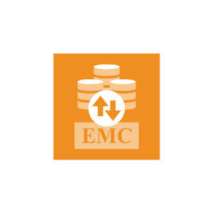

- [DirectRestoreToMsAzure](./direct-restore-to-ms-azure.md)  

- [DisasterRecovery](./disaster-recovery.md)  

- [DiskPartition](./disk-partition.md)  

- [Dns](./dns.md)  

- [Download](./download.md)  

- [DrSite](./dr-site.md)  

- [DraasEnhancements](./draas-enhancements.md)  

- [Eject](./eject.md)  

- [EncryptionKey](./encryption-key.md)  

- [EndToEndEncryption](./end-to-end-encryption.md)  

- [EndpointBackup](./endpoint-backup.md)  

- [EnterpriseManager](./enterprise-manager.md)  

- [EnterpriseScalabilityEnhancements](./enterprise-scalability-enhancements.md)  

- [ExplorerForActiveDirectory](./explorer-for-active-directory.md)  

- [ExplorerForExchange](./explorer-for-exchange.md)  

- [ExplorerForOracle](./explorer-for-oracle.md)  

- [ExplorerForSharepoint](./explorer-for-sharepoint.md)  

- [ExplorerForSql](./explorer-for-sql.md)  

- [ExplorerForStorageSnapshots](./explorer-for-storage-snapshots.md)  

- [Failed](./failed.md)  

- [FailoverPlan](./failover-plan.md)  

- [FailoverProtection](./failover-protection.md)  

- [File](./file.md)  

- [FileSystemBrowser](./file-system-browser.md)  

- [FlrHelperAppliance](./flr-helper-appliance.md)  

- [Folder](./folder.md)  

- [FreeDatastore](./free-datastore.md)  

- [FullDatastore](./full-datastore.md)  

- [FullMsIntegration](./full-ms-integration.md)  

- [Gateway](./gateway.md)  

- [GatewayServer](./gateway-server.md)  

- [Globe](./globe.md)  

- [GoogleDocument](./google-document.md)  

- [HardDrive](./hard-drive.md)  

- [HyperVHost](./hyper-v-host.md)  

- [Interface](./interface.md)  

- [Iso](./iso.md)  

- [Laptop](./laptop.md)  

- [Letter](./letter.md)  

- [Library](./library.md)  

- [License](./license.md)  

- [Linux](./linux.md)  

- [LinuxRepository](./linux-repository.md)  

- [LocalDisk](./local-disk.md)  

- [Locked](./locked.md)  

- [LostSpace](./lost-space.md)  

- [MagnifyingGlass](./magnifying-glass.md)  

- [MediaPool](./media-pool.md)  

- [MediumDatastore](./medium-datastore.md)  

- [Monitor](./monitor.md)  

- [MonitoringConsole](./monitoring-console.md)  

- [MountServer](./mount-server.md)  

- [MsExchange](./ms-exchange.md)  

- [MsExchangeItems](./ms-exchange-items.md)  

- [MsOffice](./ms-office.md)  

- [MsOutlook](./ms-outlook.md)  

- [MsSharepoint](./ms-sharepoint.md)  

- [MsSql](./ms-sql.md)  

- [MsWindows](./ms-windows.md)  

- [NasBackup](./nas-backup.md)  

- [NativeTapeSupport](./native-tape-support.md)  

- [NetworkCard](./network-card.md)  
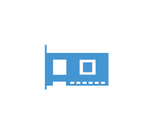

- [NetworkSwitch](./network-switch.md)  
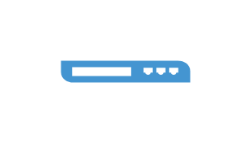

- [OnDemandSandbox](./on-demand-sandbox.md)  

- [OneBusinessView](./one-business-view.md)  

- [OneClient](./one-client.md)  
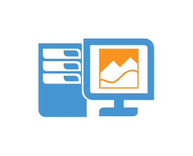

- [OneMonitor](./one-monitor.md)  

- [OneReporter](./one-reporter.md)  

- [OneServer](./one-server.md)  

- [OneServer2](./one-server-2.md)  

- [Part](./part.md)  

- [Paused](./paused.md)  

- [PhysicalServer](./physical-server.md)  

- [PhysicalStorage](./physical-storage.md)  

- [Policy](./policy.md)  

- [PortalAdmin](./portal-admin.md)  

- [Powered](./powered.md)  

- [PoweredNetwork](./powered-network.md)  

- [PowershellExtension](./powershell-extension.md)  

- [PrimaryStorageIntegration](./primary-storage-integration.md)  

- [PrivateKey](./private-key.md)  

- [ProductionSite](./production-site.md)  

- [Proxy](./proxy.md)  

- [ProxyAppliance](./proxy-appliance.md)  

- [ProxyServer](./proxy-server.md)  

- [QuickMigration](./quick-migration.md)  

- [RaidController](./raid-controller.md)  

- [Ram](./ram.md)  

- [Recording](./recording.md)  

- [RemoteRepository](./remote-repository.md)  

- [RemoteStorage](./remote-storage.md)  

- [ReplicationFromABackup](./replication-from-a-backup.md)  

- [Report](./report.md)  

- [Reporting](./reporting.md)  

- [RepositoryServer](./repository-server.md)  
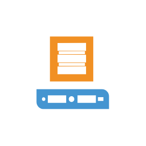

- [RestfulApi](./restful-api.md)  

- [Restore](./restore.md)  

- [RestoreDataFromVmBackup](./restore-data-from-vm-backup.md)  

- [Role](./role.md)  

- [ScaleOutRepository](./scale-out-repository.md)  

- [ScheduledBackups](./scheduled-backups.md)  

- [Script](./script.md)  

- [SdCard](./sd-card.md)  

- [Search](./search.md)  

- [SearchServer](./search-server.md)  

- [SelfServiceRecovery](./self-service-recovery.md)  

- [Server](./server.md)  
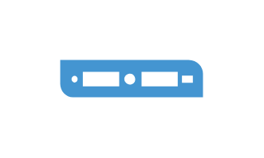

- [ServerStack](./server-stack.md)  
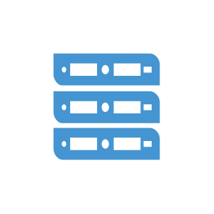

- [Service](./service.md)  

- [ServiceVnic](./service-vnic.md)  

- [Shared](./shared.md)  

- [SharedFolder](./shared-folder.md)  

- [Smb](./smb.md)  

- [Snapshot](./snapshot.md)  

- [StorageCluster](./storage-cluster.md)  

- [SureReplica](./sure-replica.md)  

- [Surebackup](./surebackup.md)  

- [Table](./table.md)  

- [Tape](./tape.md)  
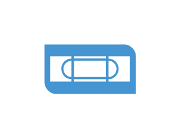

- [TapeChecked](./tape-checked.md)  

- [TapeDevice](./tape-device.md)  

- [TapeEject](./tape-eject.md)  

- [TapeLibrary](./tape-library.md)  

- [TapeLicensed](./tape-licensed.md)  

- [TapeLocked](./tape-locked.md)  

- [TapeRecording](./tape-recording.md)  
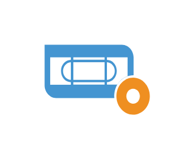

- [TapeServer](./tape-server.md)  
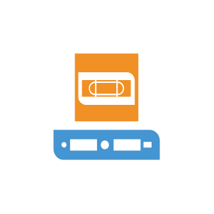

- [TapeWritingDevice](./tape-writing-device.md)  
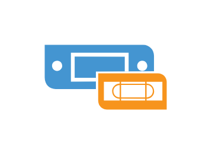

- [Tasks](./tasks.md)  

- [Time](./time.md)  

- [TransportService](./transport-service.md)  

- [Transportation](./transportation.md)  
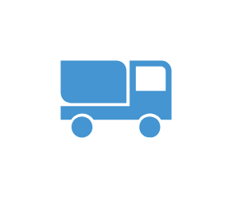

- [Unavailable](./unavailable.md)  

- [UnknownTape](./unknown-tape.md)  

- [Unlocked](./unlocked.md)  

- [Usb](./usb.md)  
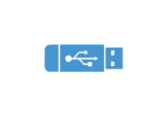

- [User](./user.md)  

- [UserGroup](./user-group.md)  

- [Vapp](./vapp.md)  
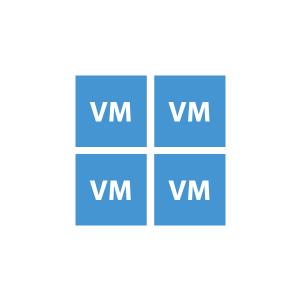

- [VcloudDirector](./vcloud-director.md)  

- [VcloudDirectorSupport](./vcloud-director-support.md)  

- [VeeamExplorer](./veeam-explorer.md)  

- [VeeamLogo](./veeam-logo.md)  

- [Veeamzip](./veeamzip.md)  

- [VideoFile](./video-file.md)  

- [VirtualHost](./virtual-host.md)  
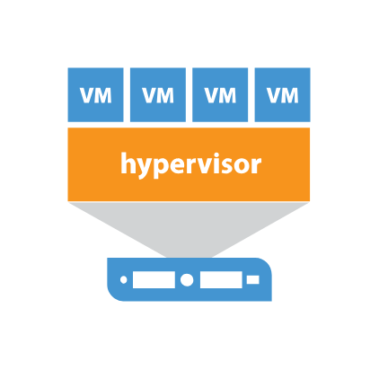

- [VirtualLab](./virtual-lab.md)  

- [VirtualMachine](./virtual-machine.md)  

- [VirtualSwitch](./virtual-switch.md)  

- [VmBackup](./vm-backup.md)  
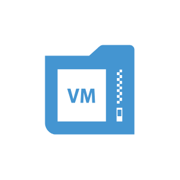

- [VmChecked](./vm-checked.md)  

- [VmFailed](./vm-failed.md)  
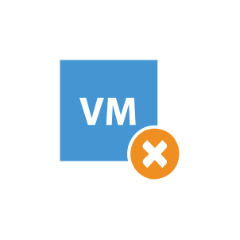

- [VmKernel](./vm-kernel.md)  

- [VmLinux](./vm-linux.md)  

- [VmLocked](./vm-locked.md)  

- [VmPaused](./vm-paused.md)  

- [VmSnapshot](./vm-snapshot.md)  

- [VmStarted](./vm-started.md)  

- [VmWindows](./vm-windows.md)  
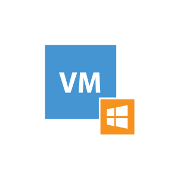

- [VmwareHost](./vmware-host.md)  
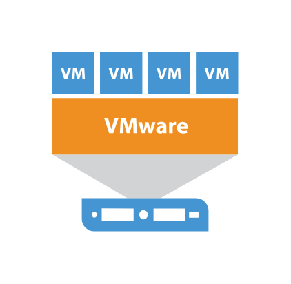

- [VmwareHyperVHost](./vmware-hyper-v-host.md)  

- [Vnic](./vnic.md)  

- [VolumeShadowCopy](./volume-shadow-copy.md)  

- [Vpn](./vpn.md)  

- [VsbFile](./vsb-file.md)  

- [Vsphere](./vsphere.md)  

- [VsphereServer](./vsphere-server.md)  

- [WanAccelerator](./wan-accelerator.md)  

- [WebConsole](./web-console.md)  

- [WebUi](./web-ui.md)  

- [WindowsLinuxServer](./windows-linux-server.md)  
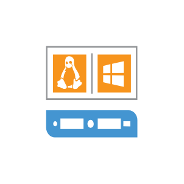

- [WindowsRepository](./windows-repository.md)  

- [Workstation](./workstation.md)  

- [Zipped](./zipped.md)  

