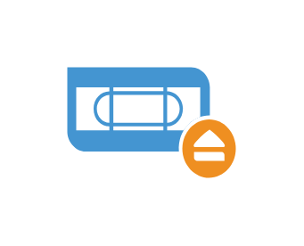

# Tape eject

## Definition

```js
{
  _style: {
    entity: 'shadow=0;dashed=0;html=1;strokeColor=none;fillColor=#4495D1;labelPosition=center;verticalLabelPosition=bottom;verticalAlign=top;align=center;outlineConnect=0;shape=mxgraph.veeam.2d.tape_ejecting;',
  },
  _width: 75.6,
  _height: 49.6,
}
```

## Usage

```js
import { TapeEject } from '@dinghy/standard-components-diagrams/veeamVmsAndTape'

<TapeEject/>
```

## Preview


