# Networking VMware Validated Design Entities

- [Administrator](./administrator.md)  

- [App](./app.md)  
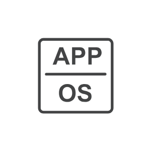

- [AppVolumesManager](./app-volumes-manager.md)  

- [AppstackVolume](./appstack-volume.md)  
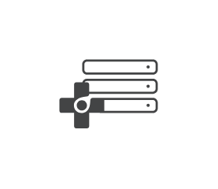

- [ArrayManager](./array-manager.md)  

- [Blueprint](./blueprint.md)  

- [BusinessContinuityDataProtection](./business-continuity-data-protection.md)  

- [Cd](./cd.md)  

- [CloudComputing](./cloud-computing.md)  
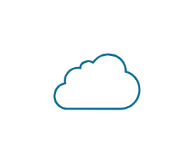

- [CollectiveNsxEsg](./collective-nsx-esg.md)  
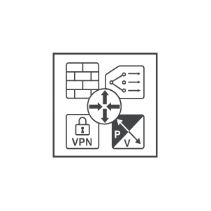

- [ConsumptionPlane](./consumption-plane.md)  

- [Cpu](./cpu.md)  
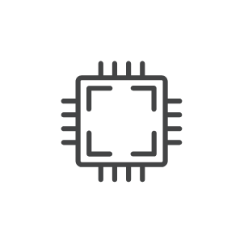

- [Datacenter](./datacenter.md)  

- [Datastore](./datastore.md)  
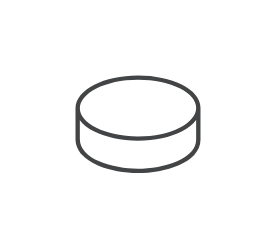

- [Disk](./disk.md)  

- [Document](./document.md)  

- [EdgeGateway](./edge-gateway.md)  
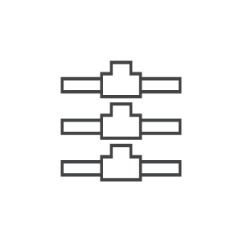

- [Endpoint](./endpoint.md)  
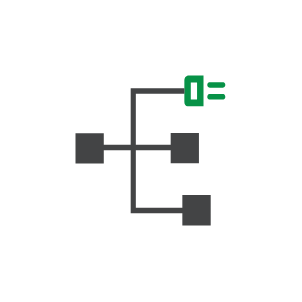

- [EndpointWhite](./endpoint-white.md)  
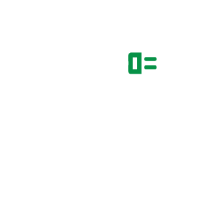

- [EthernetPort](./ethernet-port.md)  

- [ExternalNetworks](./external-networks.md)  
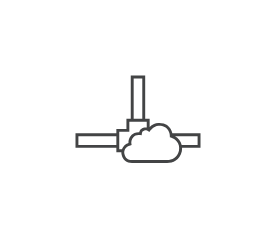

- [FlashDrive](./flash-drive.md)  
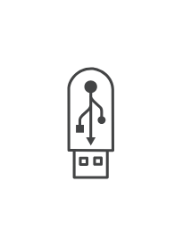

- [Folder](./folder.md)  
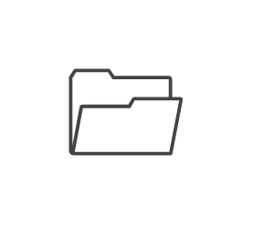

- [GuestAgentCustomization](./guest-agent-customization.md)  

- [Horizon](./horizon.md)  

- [Infrastructure](./infrastructure.md)  
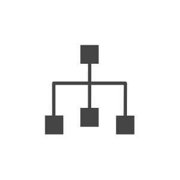

- [InfrastructureRole](./infrastructure-role.md)  

- [Key](./key.md)  

- [Keyboard](./keyboard.md)  

- [Laptop](./laptop.md)  

- [LogFiles](./log-files.md)  

- [LogicalDistribution](./logical-distribution.md)  
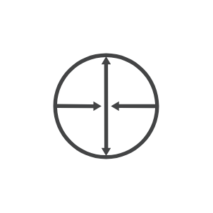

- [LogicalFirewall](./logical-firewall.md)  
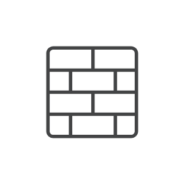

- [Machine](./machine.md)  
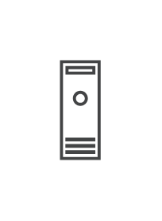

- [Memory](./memory.md)  
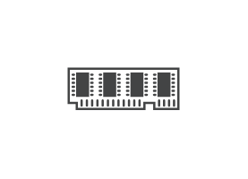

- [Monitor](./monitor.md)  

- [Mouse](./mouse.md)  
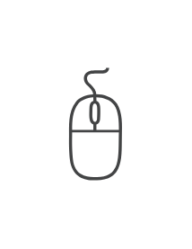

- [Networking](./networking.md)  

- [Networks](./networks.md)  
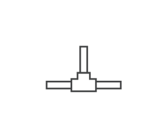

- [Nfvo](./nfvo.md)  
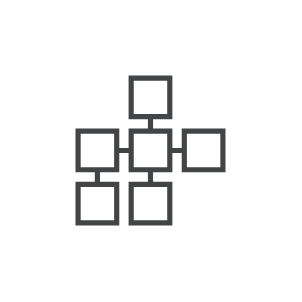

- [Nsx](./nsx.md)  
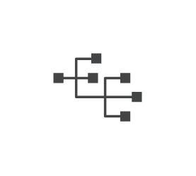

- [NsxController](./nsx-controller.md)  

- [NsxDashboard](./nsx-dashboard.md)  

- [NsxEdgeAndLoadBalancer](./nsx-edge-and-load-balancer.md)  
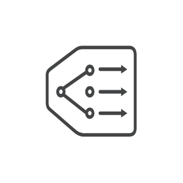

- [NsxEsg](./nsx-esg.md)  

- [NsxManager](./nsx-manager.md)  
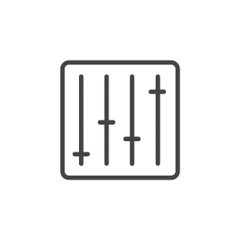

- [NsxPublicCloudGateway](./nsx-public-cloud-gateway.md)  
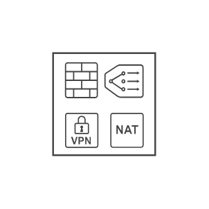

- [OnDemandSelfService](./on-demand-self-service.md)  

- [OvdcNetworks](./ovdc-networks.md)  
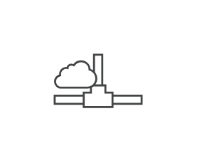

- [PairSites](./pair-sites.md)  

- [Phone](./phone.md)  

- [PhysicalNetworkAdapter](./physical-network-adapter.md)  
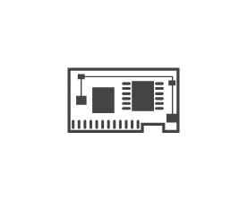

- [PhysicalStorage](./physical-storage.md)  
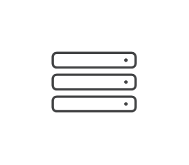

- [PhysicalUpstreamRouter](./physical-upstream-router.md)  
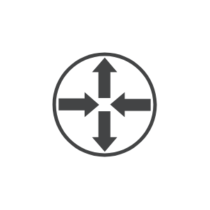

- [PlatformServicesController](./platform-services-controller.md)  

- [ProtectionGroup](./protection-group.md)  
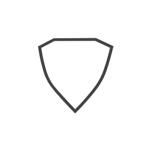

- [ProtectionGroupConfig](./protection-group-config.md)  
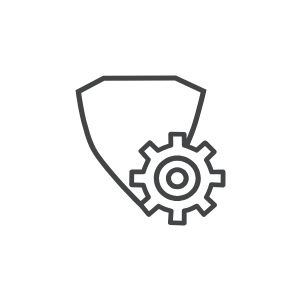

- [RecoveryPlan](./recovery-plan.md)  

- [ResourcePool](./resource-pool.md)  

- [ScsiController](./scsi-controller.md)  
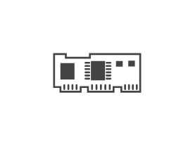

- [Security](./security.md)  

- [Server](./server.md)  
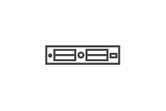

- [ServiceProviderCloudEnvironment](./service-provider-cloud-environment.md)  
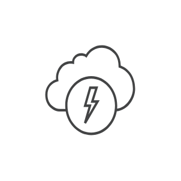

- [Site](./site.md)  

- [SiteContainer](./site-container.md)  
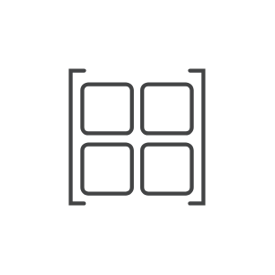

- [SiteRecovery](./site-recovery.md)  

- [SiteRecoveryFunctionalIcon](./site-recovery-functional-icon.md)  

- [Ssd](./ssd.md)  
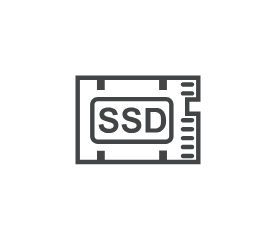

- [Storage](./storage.md)  

- [Switch](./switch.md)  
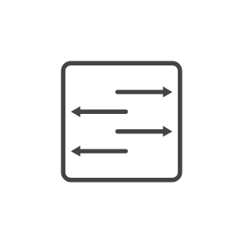

- [TelcoNetwork](./telco-network.md)  

- [Template](./template.md)  

- [TenantKey](./tenant-key.md)  

- [TenantRole](./tenant-role.md)  

- [UserGroup](./user-group.md)  

- [VappNetwork](./vapp-network.md)  
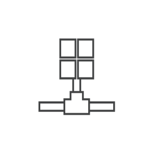

- [VcenterServer](./vcenter-server.md)  

- [VcloudDirector](./vcloud-director.md)  
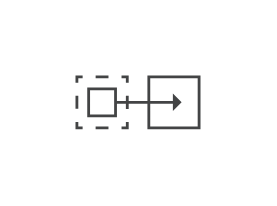

- [VirtualAppliance](./virtual-appliance.md)  
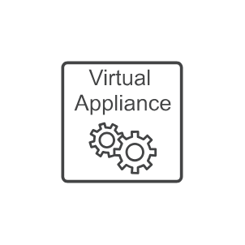

- [VirtualMachine](./virtual-machine.md)  
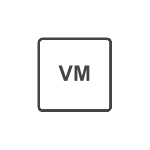

- [VirtualSwitch](./virtual-switch.md)  
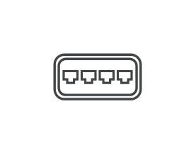

- [VmGroup](./vm-group.md)  
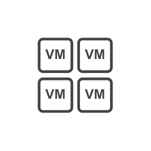

- [VnfM](./vnf-m.md)  

- [VolumesAgent](./volumes-agent.md)  

- [Vpn](./vpn.md)  

- [VrealizeAutomation](./vrealize-automation.md)  

- [VrealizeLogInsight](./vrealize-log-insight.md)  

- [VrealizeOperations](./vrealize-operations.md)  

- [VrealizeOrchestrator](./vrealize-orchestrator.md)  

- [Vrops](./vrops.md)  

- [Vsan](./vsan.md)  
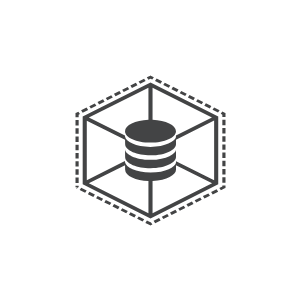

- [Vshield](./vshield.md)  
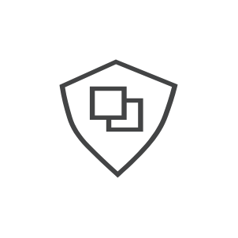

- [Vxlan](./vxlan.md)  
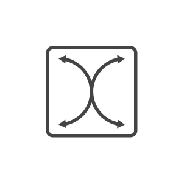

- [Wavefront](./wavefront.md)  

- [WebBrowser](./web-browser.md)  

- [WiFi](./wi-fi.md)  

- [WritableVolume](./writable-volume.md)  

