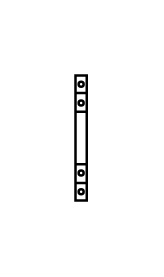

# Auxiliary Contact (Contactor 32-125A)

## Definition

```js
{
  _style: {
    entity: 'verticalLabelPosition=bottom;dashed=0;shadow=0;html=1;align=center;verticalAlign=top;shape=mxgraph.cabinets.auxiliary_contact_contactor_32_125a;',
  },
  _width: 4.5,
  _height: 50,
}
```

## Usage

```js
import { AuxiliaryContactContactor32125a } from '@dinghy/standard-components-diagrams/cabinets'

<AuxiliaryContactContactor32125a/>
```

## Preview


