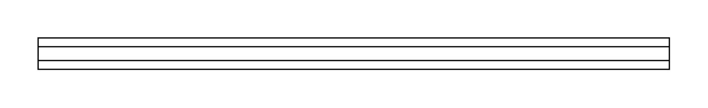

# DIN Rail

## Definition

```js
{
  _style: {
    entity: 'verticalLabelPosition=bottom;dashed=0;shadow=0;html=1;align=center;verticalAlign=top;shape=mxgraph.cabinets.din_rail;',
  },
  _width: 500,
  _height: 25,
}
```

## Usage

```js
import { DinRail } from '@dinghy/standard-components-diagrams/cabinets'

<DinRail/>
```

## Preview


