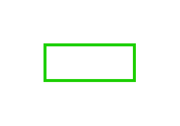

# Message Sequence

## Definition

```js
{
  _style: {
    entity: 'curved=1;endArrow=block;html=1;strokeColor=#1CCF00;strokeWidth=2;endSize=3;rounded=0;',
  },
  _width: 60,
  _height: 24,
}
```

## Usage

```js
import { MessageSequence } from '@dinghy/standard-components-diagrams/eipMessageConstruction'

<MessageSequence/>
```

## Preview


