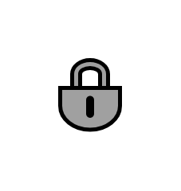

# Durable Subscriber

## Definition

```js
{
  _style: {
    entity: 'dashed=0;outlineConnect=0;strokeWidth=2;html=1;align=center;fontSize=8;verticalLabelPosition=bottom;verticalAlign=top;shape=mxgraph.eip.durable_subscriber;fillColor=#a0a0a0;',
  },
  _width: 30,
  _height: 35,
}
```

## Usage

```js
import { DurableSubscriber } from '@dinghy/standard-components-diagrams/eipMessagingEndpoints'

<DurableSubscriber/>
```

## Preview


