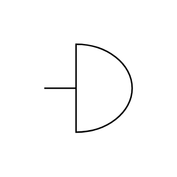

# Bell

## Definition

```js
{
  _style: {
    entity: 'pointerEvents=1;verticalLabelPosition=bottom;shadow=0;dashed=0;align=center;html=1;verticalAlign=top;shape=mxgraph.electrical.electro-mechanical.bell;',
  },
  _original_width: 47,
  _original_height: 60,

}
```

## Usage

```js
import { Bell } from '@dinghy/standard-components-diagrams/electricalAudio'

<Bell/>
```

## Preview


