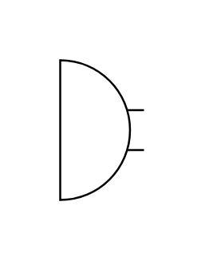

# Microphone 2

## Definition

```js
{
  _style: {
    entity: 'verticalLabelPosition=bottom;shadow=0;dashed=0;align=center;html=1;verticalAlign=top;shape=mxgraph.electrical.radio.microphone_2;',
  },
  _width: 42,
  _height: 70,
}
```

## Usage

```js
import { Microphone2 } from '@dinghy/standard-components-diagrams/electricalAudio'

<Microphone2/>
```

## Preview


