# Electrical Inductors Entities

- [Component1PhaseInductionVoltageRegulator](./component-1-phase-induction-voltage-regulator.md)  

- [AdjustableTransformer](./adjustable-transformer.md)  
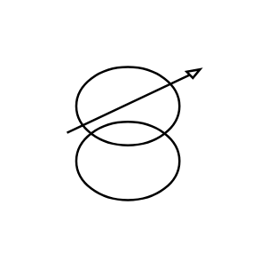

- [Choke](./choke.md)  
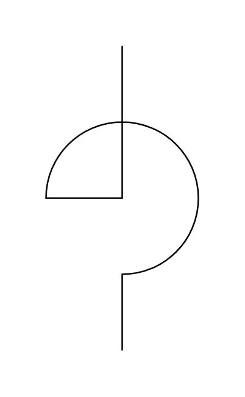

- [CoaxialChoke](./coaxial-choke.md)  
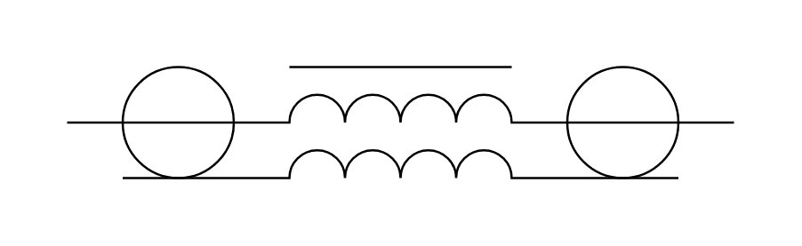

- [CurrentTransformer](./current-transformer.md)  

- [CurrentTransformer2](./current-transformer-2.md)  
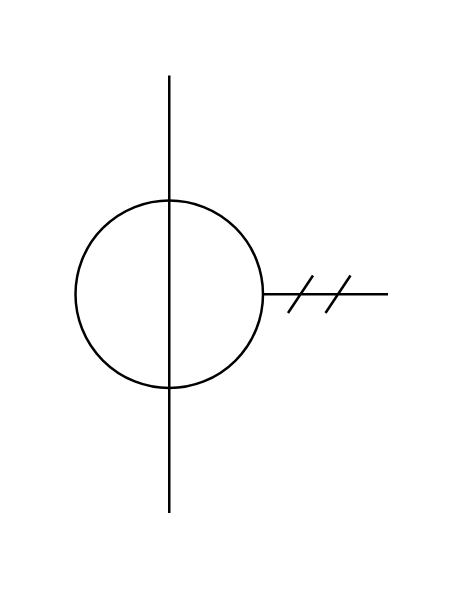

- [CurrentTransformer3](./current-transformer-3.md)  
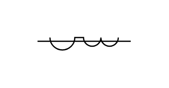

- [FerriteCore](./ferrite-core.md)  
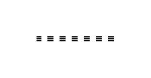

- [HalfInductor](./half-inductor.md)  
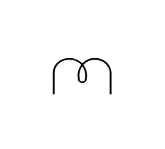

- [InductionVoltageRegulator](./induction-voltage-regulator.md)  

- [Inductor](./inductor.md)  
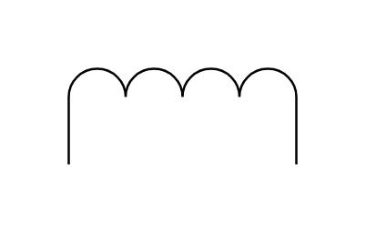

- [InductorAirCore](./inductor-air-core.md)  

- [InductorAirCore2](./inductor-air-core-2.md)  
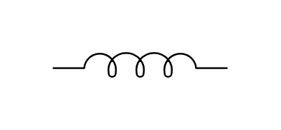

- [InductorAirCore3](./inductor-air-core-3.md)  
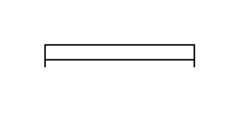

- [IronCore](./iron-core.md)  

- [LinearCoupler](./linear-coupler.md)  
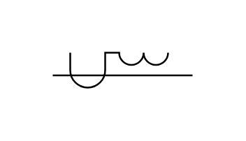

- [MagneticCore](./magnetic-core.md)  
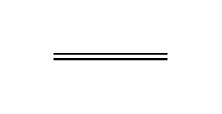

- [OutdoorMeteringDevice](./outdoor-metering-device.md)  
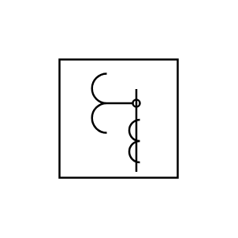

- [PotTrans3Windings](./pot-trans-3-windings.md)  
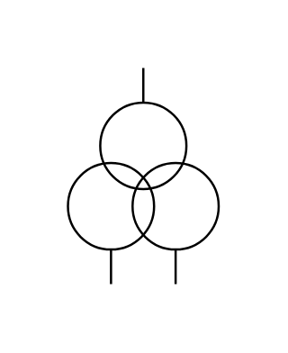

- [PotentialTransformer](./potential-transformer.md)  

- [PotentialTransformer2](./potential-transformer-2.md)  
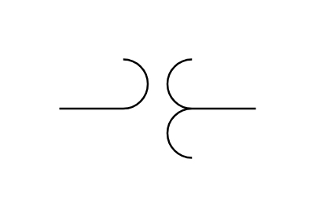

- [SaturatingTransformer](./saturating-transformer.md)  

- [Transductor](./transductor.md)  
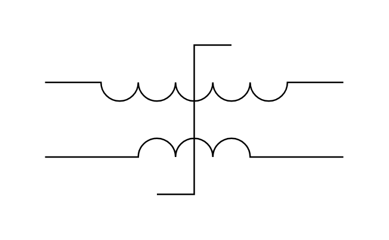

- [Transformer](./transformer.md)  

- [TransformerIronCore](./transformer-iron-core.md)  
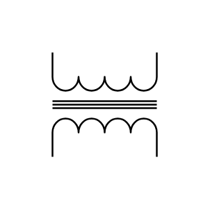

- [TransformerIronCore2](./transformer-iron-core-2.md)  
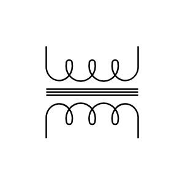

- [Transformer2](./transformer-2.md)  

- [TriplexInductionVoltageRegulator](./triplex-induction-voltage-regulator.md)  
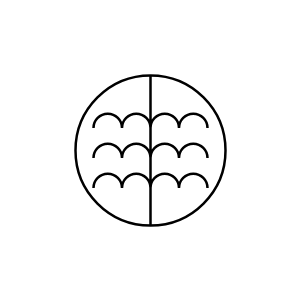

- [Variable](./variable.md)  
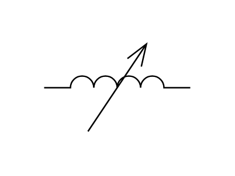

- [Variometer](./variometer.md)  
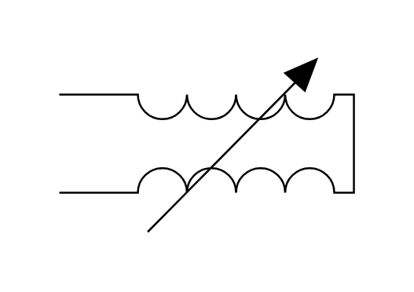
