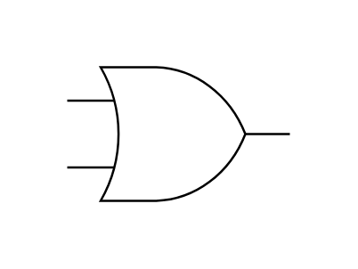

# OR

## Definition

```js
{
  _style: {
    entity: 'verticalLabelPosition=bottom;shadow=0;dashed=0;align=center;html=1;verticalAlign=top;shape=mxgraph.electrical.logic_gates.logic_gate;operation=or;',
  },
  _width: 100,
  _height: 60,
}
```

## Usage

```js
import { Or } from '@dinghy/standard-components-diagrams/electricalLogicGates'

<Or/>
```

## Preview


