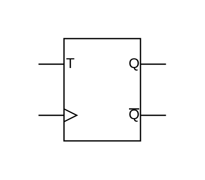

# T Type Flip-Flop

## Definition

```js
{
  _style: {
    entity: 'verticalLabelPosition=bottom;shadow=0;dashed=0;align=center;html=1;verticalAlign=top;shape=mxgraph.electrical.logic_gates.t_type_flip-flop;',
  },
  _width: 100,
  _height: 80,
}
```

## Usage

```js
import { TTypeFlipFlop } from '@dinghy/standard-components-diagrams/electricalLogicGates'

<TTypeFlipFlop/>
```

## Preview


